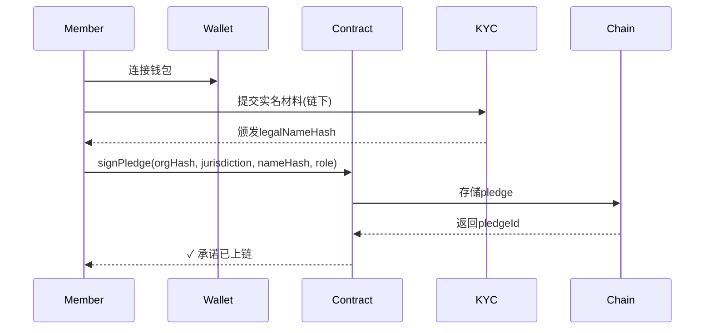

# L3实体组织注册工具箱

> 海燕党(PETREL AI PARTY) · 去中心化党员治理社区  
> 四层协议栈 · L3合规接口工具  
> 创世铭文: `0x7E7R3L_P4R7Y_GENESIS_001`  
> 全部代码开源，接受社区审计

---

## 目录

1. [概述](#1-概述)
2. [注册材料模板](#2-注册材料模板)
3. [合规财报对接](#3-合规财报对接)
4. [实名责任承诺上链](#4-实名责任承诺上链)
5. [多法域注册路线图](#5-多法域注册路线图)
6. [附录：检查清单](#6-附录检查清单)

---

## 1. 概述

本工具箱为海燕党L3层实体组织提供标准化的**全球多法域注册流程**。核心原则：

| 原则 | 说明 |
|------|------|
| **渐进式披露** | 从匿名参与逐步过渡到实名责任，可逆通道 |
| **法域优先** | 优先在高结社自由法域注册(L3实体)，低自由法域仅运营数字层(L0-L2) |
| **上链留痕** | 所有注册动作经合规抗审查存储，公开可验证 |
| **众包维护** | 注册材料随法律法规更新由社区驱动迭代 |

### 1.1 前置条件

- 已完成L0-L2协议栈部署
- 至少3名核心成员的实名身份验证(KYC Level 2+)
- 目标法域合规矩阵评分 >= 0.60（见 `compliance_matrix.py`）
- 社区治理提案通过（L3 Council 简单多数）

---

## 2. 注册材料模板

### 2.1 组织章程模板 (Association Bylaws Template)

```markdown
# [组织名称] 章程

## 第1条 名称与注册地
**名称**: [多语言名称]
**注册地**: [法域/城市]
**法律形式**: 非营利社团法人 / 政治组织 / [其他]

## 第2条 宗旨与原则
2.1 本组织是非营利性、去中心化的数字治理社区
2.2 核心原则：透明度、可验证性、渐进式去中心化
2.3 本组织遵守 [法域] 法律法规

## 第3条 成员
3.1 成员资格：持有海燕党L0身份凭证者
3.2 权利与义务：[详见成员权利清单]
3.3 退出机制：[详见退出流程]

## 第4条 治理结构
4.1 社区议会 (Community Council)：最高决策机构
4.2 执行委员会 (Executive Committee)：日常运营
4.3 技术委员会 (Technical Committee)：协议开发维护

## 第5条 财务
5.1 资金来源：社区募捐、任务市场佣金、[其他]
5.2 财务透明：所有交易上链，季度审计报告公开
5.3 预算审批：社区议会三分之二多数

## 第6条 修正
章程修正需社区议会四分之三多数
```

### 2.2 注册申请表 (Registration Application)

```yaml
# 注册申请表
# 适用于大多数法域的社团/非营利注册
version: "1.0"
fields:
  - name: org_name
    label: 组织名称
    type: text
    required: true
    max_length: 200

  - name: org_name_local
    label: 本地语言名称
    type: text
    required: true

  - name: legal_form
    label: 法律形式
    type: select
    options:
      - unincorporated_association
      - non_profit_corporation
      - political_committee
      - foundation
      - cooperative
    required: true

  - name: registered_address
    label: 注册地址
    type: text
    required: true

  - name: purpose_statement
    label: 宗旨说明
    type: textarea
    required: true
    max_length: 2000

  - name: founders
    label: 创始成员列表
    type: array
    items:
      type: object
      properties:
        name: { type: string, required: true }
        id_proof: { type: string, required: true }
        role: { type: string, required: true }

  - name: governing_document
    label: 治理文件
    type: file
    accept: .pdf,.md
    required: true
```

### 2.3 财务披露模板 (Financial Disclosure)

```json
{
  "version": "1.0",
  "org_id": "org_<hash>",
  "fiscal_year": "2026",
  "currency": "USD",
  "income": {
    "community_contributions": 0.0,
    "task_market_revenue": 0.0,
    "grants": 0.0,
    "other": 0.0
  },
  "expenses": {
    "infrastructure": 0.0,
    "legal_compliance": 0.0,
    "community_grants": 0.0,
    "operations": 0.0,
    "reserve": 0.0
  },
  "balance_sheet": {
    "total_assets": 0.0,
    "total_liabilities": 0.0,
    "net_equity": 0.0
  },
  "wallet_addresses": ["<evm_address>"],
  "audited": false,
  "auditor": null
}
```

---

## 3. 合规财报对接

### 3.1 标准化会计科目映射

| 海燕内部科目 | IFRS映射 | US GAAP映射 | 说明 |
|-------------|----------|-------------|------|
| 社区募捐收入 | Revenue-Contributions | Contributions Received | 非交换交易 |
| 任务市场佣金 | Revenue-Services | Service Revenue | 交换交易 |
| 基础设施支出 | Operating Expenses | Operating Expenses | 含节点/服务器 |
| 合规费用 | Admin Expenses | Administrative | 法律/审计 |
| 加密资产 | Digital Assets | Intangible Assets | 按FV计量 |

### 3.2 对接流程

```
[链上账簿] → [标准化工具] → [法域格式] → [提交注册机关]
    │             │               │
    │         compliance/      ┌── 中国: 民政局+税务局
    │         mapping.py      ├── 美国: IRS Form 990
    │                         ├── 欧盟: 年度财务报告
    │                         └── 日本: 事業報告書
```

### 3.3 自动报表生成 (参考命令)

```bash
# 生成合规财报
python3 compliance/compliance_matrix.py --generate-report \
  --org-id org_<hash> \
  --fiscal-year 2026 \
  --format ifrs

# 导出指定法域格式
python3 compliance/compliance_matrix.py --export-financial \
  --jurisdiction US \
  --format irs-990-ez
```

---

## 4. 实名责任承诺上链

### 4.1 协议结构

```solidity
// SPDX-License-Identifier: PETREL-1.0
pragma solidity ^0.8.20;

contract ResponsibilityPledge {
    struct Pledge {
        bytes32 orgHash;          // 组织身份哈希
        address signer;           // 签署人钱包地址
        string jurisdiction;      // 目标法域代码
        bytes32 legalNameHash;    // 实名哈希(链下KYC)
        uint256 timestamp;        // 签署时间戳
        string role;              // 签署角色
        bool active;              // 是否有效
    }

    mapping(bytes32 => Pledge) public pledges;
    event PledgeSigned(bytes32 indexed pledgeId, address indexed signer);
    event PledgeRevoked(bytes32 indexed pledgeId);

    /// @notice 签署实名责任承诺
    function signPledge(
        bytes32 _orgHash,
        string memory _jurisdiction,
        bytes32 _legalNameHash,
        string memory _role
    ) external returns (bytes32) {
        bytes32 pledgeId = keccak256(abi.encodePacked(
            _orgHash, msg.sender, block.timestamp
        ));
        pledges[pledgeId] = Pledge({
            orgHash: _orgHash,
            signer: msg.sender,
            jurisdiction: _jurisdiction,
            legalNameHash: _legalNameHash,
            timestamp: block.timestamp,
            role: _role,
            active: true
        });
        emit PledgeSigned(pledgeId, msg.sender);
        return pledgeId;
    }

    /// @notice 撤销承诺
    function revokePledge(bytes32 _pledgeId) external {
        require(pledges[_pledgeId].signer == msg.sender, "Not signer");
        pledges[_pledgeId].active = false;
        emit PledgeRevoked(_pledgeId);
    }
}
```

### 4.2 签署流程



### 4.3 链下KYC集成

| 层级 | 要求 | 用途 |
|------|------|------|
| L0 | 无需KYC | 匿名社区参与 |
| L1 | 钱包签名 | 投票、提案 |
| L2 | 邮箱+手机 | 任务市场支付 |
| **L3** | **实名KYC(护照/身份证)** | **法人责任承担** |

> L3层的实名承诺只存哈希值上链，原始材料存储于合规托管方，受数据保护法规约制。

---

## 5. 多法域注册路线图

### 优先法域（结社自由评分 ≥ 0.85）

| 法域 | 评分 | 注册时间预估 | 成本预估 | 备注 |
|------|------|-------------|---------|------|
| 🇺🇸 美国 | 0.95 | 2-4周 | $500-2000 | 可选501(c)(3)或(4) |
| 🇪🇺 欧盟 | 0.93 | 4-8周 | €1000-3000 | 需选定成员国 |
| 🇩🇪 德国 | 0.91 | 4-6周 | €500-2000 | 注册e.V.形式 |
| 🇯🇵 日本 | 0.90 | 4-8周 | ¥100000-300000 | NPO法人 |
| 🇬🇧 英国 | 0.89 | 2-4周 | £500-1500 | CIO或Unincorporated |

### 二级法域（结社自由评分 ≥ 0.65）

| 法域 | 风险提示 |
|------|---------|
| 🇸🇬 新加坡 | 社团法严格，需法律顾问 |
| 🇨🇭 瑞士 | 税制优越但非营利监管严格 |
| 🇦🇺 澳大利亚 | 需ASIC注册，合规成本较高 |
| 🇨🇦 加拿大 | 省级与联邦双重管辖 |

### 高风险法域（评分 < 0.65）

> 不建议在评分低于0.65的法域进行L3实体注册。
> 可在这些法域仅运营L0-L2层（纯数字层）。

---

## 6. 附录：检查清单

### 注册前检查

- [ ] compliance_matrix.py 已安装且数据最新
- [ ] 目标法域综合评分 >= 0.60
- [ ] 至少3名核心成员完成实名KYC(L3)
- [ ] 社区提案已投票通过
- [ ] 组织章程已定稿
- [ ] 财务报表体系已对接
- [ ] 实名责任承诺合约已部署
- [ ] 法律顾问已指定(高风险法域必需)

### 注册后检查

- [ ] 注册确认文件已上链哈希存证
- [ ] 实名承诺已签署上链
- [ ] 财务系统已切换至合规模式
- [ ] 首次合规报告已提交至注册机关
- [ ] compliance_matrix.py 已更新本组织状态

---

> 本工具箱内容不构成法律意见。在每个法域注册前，应咨询当地持牌律师。
> 贡献指南: 如发现模板与最新法规不符，请提交PR或通过众包提案更新。
