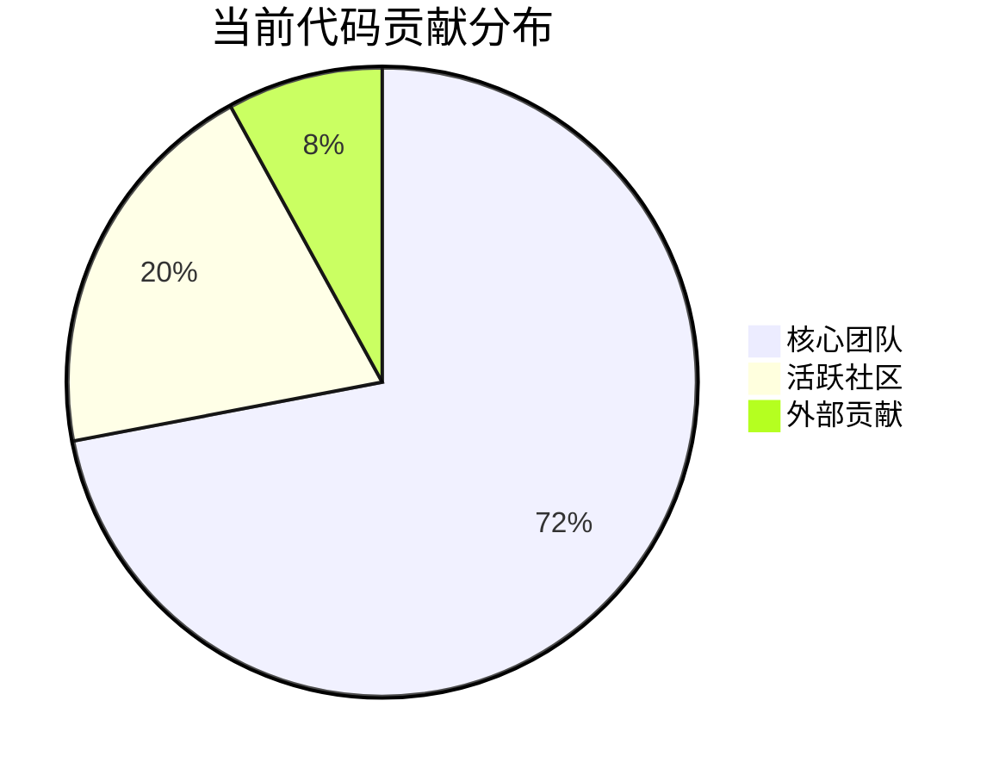
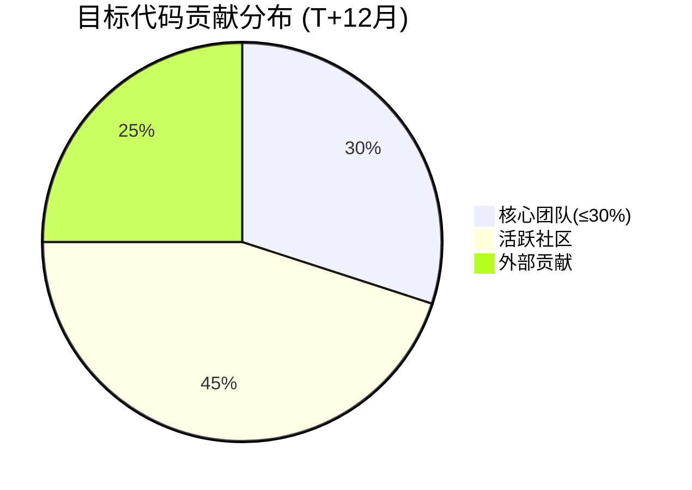
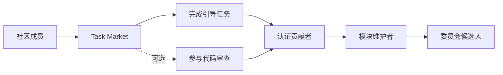

# 工程组织去中心化过渡方案

> 海燕党(PETREL AI PARTY) · 去中心化党员治理社区  
> Phase 5 成熟期 · 去中心化过渡  
> 创世铭文: `0x7E7R3L_P4R7Y_GENESIS_001`  
> 全部代码开源，接受社区审计

---

## 1. 概述

本文件定义海燕党工程组织从**核心团队主导**过渡到**完全去中心化社区维护**的方案。

### 1.1 核心目标

| 目标 | 量化标准 | 时间线 |
|------|---------|--------|
| 核心团队占比 | < 30% (代码贡献者) | T+12月 |
| 维护权移交 | 选举多签委员会 | T+6月 |
| 无单点故障 | 每模块≥2维护者 | T+9月 |
| 社区自运转 | 提案-开发-审计-发布全流程社区驱动 | T+18月 |

### 1.2 核心理念

> **去中心化不是一次切换，而是持续的过程。**

每次权力移交必须具备以下条件：
1. 接收方已证明其能力(通过任务市场完成≥3个相关任务)
2. 移交过程完全公开可审计
3. 保留回滚机制(候选期为3个月)

---

## 2. 当前状态评估

### 2.1 中心化风险点

| 风险项 | 当前状态 | 风险等级 | 去中心化方案 |
|--------|---------|---------|-------------|
| 代码仓库管理 | 核心团队100%维护者 | 🔴 | 分模块移交+多签 |
| 智能合约部署 | 核心团队私钥 | 🔴 | 多签部署合约 |
| 关键基础设施 | 核心团队运维 | 🟡 | 运维手册+轮值 |
| 社区基金 | 多签但核心团队占多数 | 🟡 | 社区选举多签委员 |
| 协议演进决策 | 核心团队主导 | 🟢 | 已通过提案治理 |

### 2.2 代码库所有权分布



### 2.3 目标状态



---

## 3. 阶段一：维护权移交 (T+0 ~ T+6月)

### 3.1 选举多签委员会

```yaml
multisig_committee:
  name: "海燕协议维护委员会"
  size: 7
  threshold: 4/7

  election_process:
    - 社区提名(自荐+他荐)
    - 候选人陈述(在社区会议+书面)
    - 社区投票(基于信誉加权投票)
    - 当选者公布

  term: "12个月"
  term_limit: "最多连任2届"

  responsibilities:
    - "审批PR合并"
    - "管理合约部署密钥"
    - "协调紧急安全修复"
    - "仲裁开发争议"

  election_calendar:
    nomination: "T+1月"
    voting: "T+2月"
    installation: "T+3月"
    first_term: "T+3月 ~ T+15月"

  removal_mechanism:
    - "社区动议(20%支持)"
    - "投票(66%同意)"
    - "立即生效"
```

### 3.2 模块化仓库移交

```yaml
module_transfer_plan:
  timeline:
    - phase: "Phase A (T+0~2月)"
      modules:
        - "任务市场 (task_market.py)"
        - "合规矩阵 (compliance_matrix.py)"

    - phase: "Phase B (T+2~4月)"
      modules:
        - "合法请求处理 (legal_requests.py)"
        - "测试套件"

    - phase: "Phase C (T+4~6月)"
      modules:
        - "智能合约部署管理"
        - "基础设施运维"

  transfer_requirements:
    - "目标维护者完成≥3个相关任务市场任务"
    - "目标维护者在至少1次代码审查中表现合格"
    - "原维护者与新维护者并行工作2周"
    - "社区投票确认移交"
```

### 3.3 GitHub 权限模型过渡

```yaml
github_permissions:
  current:
    - "核心团队: Admin (5人)"

  transition_phase:
    - "维护委员会: Admin (7人)"
    - "核心团队: Maintain (降级)"
    - "社区贡献者: Write (基于任务市场认证)"

  final_state:
    - "维护委员会: Admin (选举产生)"
    - "核心团队(个人): Write (非特权)"
    - "认证贡献者: Triage → Write"
```

---

## 4. 阶段二：能力去中心化 (T+6 ~ T+12月)

### 4.1 开发者入职通道



```yaml
developer_onboarding:
  entry_tasks:            # 入门任务 (Task Market)
    count: 3
    types: ["documentation", "bug_fix", "test_addition"]
    estimated_time: "2-4周"

  certification:
    requirements:
      - "完成5个任务(其中1个为复杂功能开发)"
      - "参与≥3次代码审查"
      - "通过社区面试(技术+理念匹配)"
    benefit: "获取仓库Write权限"

  module_maintainer:
    requirements:
      - "成为认证贡献者≥3个月"
      - "在目标模块有≥3个合并PR"
      - "社区信任投票(支持率≥60%)"
    benefit: "作为模块负责人"
```

### 4.2 文档与知识转移

```yaml
knowledge_transfer:
  required_docs:
    - "每个模块的架构文档(ARCHITECTURE.md)"
    - "部署手册(ops/deployment.md)"
    - "紧急恢复手册(ops/incident-response.md)"
    - "每个模块有视频讲解会议记录"

  transfer_sessions:
    frequency: "每月2次"
    format: "公开直播+录播"
    topics: ["架构演进", "安全实践", "运营心得"]

  documentation_status:
    current_coverage: "45%"
    target_coverage: "90%"
    deadline: "T+9月"
```

### 4.3 关键依赖消除

```yaml
key_person_risk:
  current:
    critical_dependencies: 4      # 只有1人知道如何操作的模块
    high_dependencies: 6           # 只有2人知道的模块

  target:
    critical_dependencies: 0      # 每个模块≥3人
    high_dependencies: 3

  actions:
    - "交叉培训: 核心成员带教社区成员"
    - "记录所有runbook: 不依赖个人记忆"
    - "故障演练: 每月模拟关键人员失联场景"
```

---

## 5. 阶段三：完全去中心化 (T+12 ~ T+18月)

### 5.1 治理模型终态

```yaml
final_governance_model:
  legislative:
    body: "社区议会"
    selection: "随机抽签(VRL协议)"
    term: "6个月"
    power: "提案批准、参数调整"

  executive:
    body: "维护委员会"
    selection: "社区选举"
    size: "7人"
    term: "12个月"
    power: "代码合并、合约部署、安全响应"

  judicial:
    body: "争议委员会"
    selection: "随机+选举混合"
    size: "5人"
    power: "纠纷仲裁、违规处罚"

  checks_and_balances:
    - "议会可否决委员会的部署提案(66%多数)"
    - "委员会可暂缓议会参数调整(需说明理由)"
    - "争议委员会可审查双方行为"
    - "任何决定可被社区超级多数(80%)推翻"
```

### 5.2 核心团队退出计划

```yaml
core_team_exit:
  principle: >
    核心团队逐步从执行角色转为顾问角色，
    最终完全退出任何特权操作。

  schedule:
    - "T+0月: 核心团队占Admin 5/5 (100%)"
    - "T+3月: 移交Admin给委员会，核心团队占Maintain"
    - "T+6月: 核心团队占Contribute权限(与社区一致)"
    - "T+12月: 核心团队创始成员可选择保留荣誉角色(无控制权)"
    - "T+18月: 核心团队不再持有任何特殊权限"

  golden_parachute:
    - "创始成员获得社区终身荣誉身份(无治理特权)"
    - "代码库中永久保留创始贡献者署名"
    - "保留参与治理提案的普通成员权利"
```

---

## 6. 安全考量

### 6.1 密钥管理

```yaml
key_management:
  deployment_key:
    current: "核心团队单私钥"
    transition: "3/5 多签(核心团队2+委员会1)"
    final: "4/7 多签(委员会)"

  emergency_key:
    current: "核心团队备份"
    final: "分布式存储 + 时间锁延迟(72h)"

  backup:
    storage: "物理分片 + Shamir Secret Sharing (4/7)"
    locations: "4个不同地理区域"
```

### 6.2 防接管机制

```yaml
takeover_prevention:
  - mechanism: "时间锁"
    description: "所有敏感操作延迟生效(≥72h)"
    purpose: "给社区留出响应时间"

  - mechanism: "社交恢复"
    description: "若委员会成员私钥丢失，5名社区成员可发起恢复"
    purpose: "防止委员会成员失能"

  - mechanism: "治理断路器"
    description: "社区可通过80%超级多数暂停委员会权力"
    purpose: "防止委员会恶意行为"
```

### 6.3 渐进式移交清单

```markdown
## 移交检查清单

### 模块移交前
- [ ] 模块文档完整性 ≥ 90%
- [ ] 测试覆盖率 ≥ 80%
- [ ] 接收到维护者完成入职培训
- [ ] 并行工作2周验证通过
- [ ] 社区投票确认移交
- [ ] 所有密钥/凭据完成转移

### 委员会移交前
- [ ] 委员会选举流程已完成
- [ ] 多签合约已部署验证
- [ ] 备份密钥已分片存储
- [ ] 紧急响应手册已编写
- [ ] 模拟移交演练通过

### 完全去中心化前
- [ ] 核心团队代码贡献 < 30%
- [ ] 每个模块 ≥ 3名维护者
- [ ] 委员会成功运行 ≥ 2个完整任期
- [ ] 至少1次安全的去中心化故障演练
- [ ] 社区自我治理持续 ≥ 6个月
```

---

## 7. 风险与缓解

| 风险 | 概率 | 影响 | 缓解 |
|------|------|------|------|
| 移交后代码质量下降 | 中 | 高 | 强制代码审查、自动化测试门禁 |
| 委员会内部分裂 | 低 | 高 | 争议仲裁机制、超级多数回滚 |
| 贡献者流失 | 中 | 中 | 持续社区建设、任务市场激励机制 |
| 安全漏洞响应变慢 | 中 | 高 | 安全响应委员会(on-call轮值) |
| 中心化回归(re-centralization) | 低 | 高 | 自动触发防回退机制、定期去中心化审计 |

---

## 8. 去中心化指数 (Decentralization Index)

作为过渡进度的量化跟踪指标:

```python
def calculate_decentralization_index() -> dict:
    """计算工程去中心化指数 (0-100)"""
    scores = {
        "code_ownership": _code_ownership_score(),       # 代码贡献分布
        "key_management": _key_management_score(),       # 密钥管理去中心化
        "decision_making": _decision_making_score(),     # 决策权分布
        "knowledge_distribution": _knowledge_score(),    # 知识分布
        "infrastructure": _infrastructure_score(),        # 基础设施去中心化
    }
    total = sum(scores.values()) / len(scores)
    return {"scores": scores, "total": total}
```

| 指数区间 | 状态 | 说明 |
|---------|------|------|
| 0-30 | 集中期 | 核心团队主导 |
| 30-60 | 过渡期 | 逐步移交 |
| 60-85 | 成熟期 | 社区主导，核心团队顾问 |
| 85-100 | 完全去中心化 | 无单点控制 |

---

> 去中心化是目的而非手段。  
> 过渡方案需经L3 Council投票通过后逐步执行。  
> 任何阶段的回退均需社区超级多数同意。
