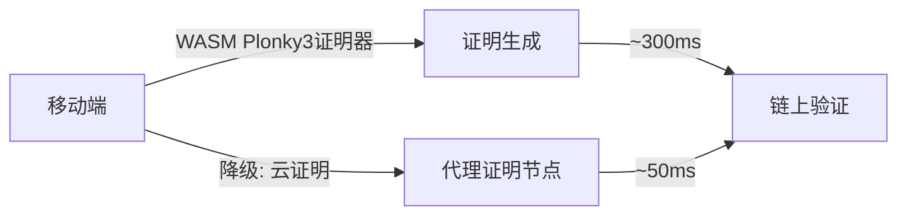
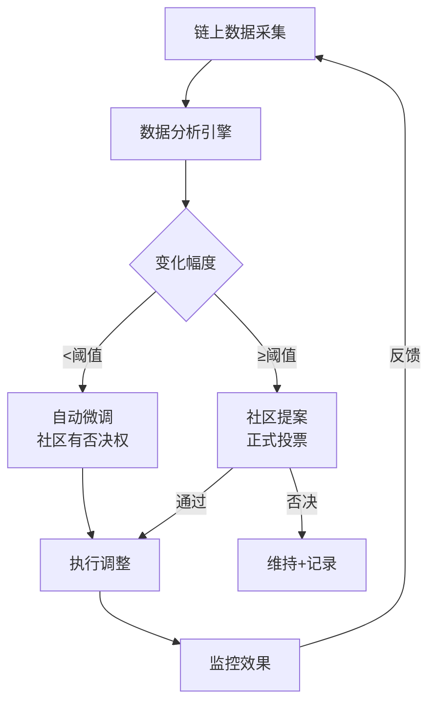

# 协议第三代迭代技术规范 (Protocol v3)

> 海燕党(PETREL AI PARTY) · 去中心化党员治理社区  
> Phase 5 成熟期 · 协议演进  
> 创世铭文: `0x7E7R3L_P4R7Y_GENESIS_001`  
> 全部代码开源，接受社区审计

---

## 1. 概述

Protocol v3 是海燕党四层协议栈的**第三代迭代**。v1奠定了分层架构的基础，v2引入了ZKP凭证和L3实体层，v3在成熟期聚焦于三个核心方向：

| 方向 | 目标 | 优先级 |
|------|------|--------|
| **ZKP递归证明升级(移动化)** | 降低证明生成门槛，支持移动端验证 | P0 |
| **AI能力升级(可解释性)** | 链上治理决策的AI解释与推理路径公开 | P0 |
| **治理规则数据驱动修订** | 根据链上数据进行协议参数的自动/半自动调整 | P1 |

---

## 2. ZKP递归证明升级

### 2.1 现状与目标

**现状 (v2):**
- 使用 Groth16 方案，单证明验证成本 ~200K gas
- 证明生成需要 8GB+ 内存，不适合移动设备
- 递归证明链长度限制在 8 层

**目标 (v3):**
| 指标 | v2 | v3 |
|------|----|----|
| 证明生成内存 | ≥8GB | ≤512MB |
| 移动端支持 | ❌ | ✅ (WASM/原生) |
| 递归证明层数 | ≤8 | ≥64 |
| 验证gas | ~200K | ≤50K |
| 聚合证明 | ❌ | ✅ (批量验证) |

### 2.2 技术方案

#### 2.2.1 证明系统迁移

```
v2: Groth16 (BN254) ──────▶ v3: Plonky3 + Nova recursion
       │                           │
       ├ 单证明                    ├ 递归聚合证明
       ├ 需可信设置                ├ 透明设置(无Trusted Setup)
       └ Gas: ~200K               └ Gas: ~30K
```

#### 2.2.2 移动端证明生成



```python
# protocol_v3_zkp_mobile.py (参考接口)

class MobileProver:
    """轻量级移动端证明生成器"""

    SUPPORTED_PLATFORMS = ["wasm", "ios_native", "android_native"]

    def generate_proof(self, statement: dict, platform: str) -> bytes:
        """在移动/桌面端生成ZKP证明"""
        if platform not in self.SUPPORTED_PLATFORMS:
            raise ValueError(f"不支持的平台: {platform}")
        # Plonky3 证明生成 (WASM/原生)
        proof = plonky3_prove(statement, recursive_layers=4)
        return proof.serialize()

    def verify_aggregated(self, proofs: List[bytes]) -> bool:
        """批量验证聚合证明"""
        # Nova-style recursive verification
        return nova_verify_batch(proofs)

    def estimate_cost(self, num_statements: int) -> dict:
        return {
            "memory_mb": 128 + num_statements * 32,
            "time_ms": 200 + num_statements * 50,
            "gas_estimate": 30000 + num_statements * 5000,
        }
```

### 2.3 迁移计划

| Phase | 内容 | 时间线 |
|-------|------|--------|
| v3.0 | Plonky3 替换 Groth16 | T+0 |
| v3.1 | Nova递归聚合 | T+2月 |
| v3.2 | WASM移动端证明器 | T+4月 |
| v3.3 | 批量验证优化 | T+6月 |

---

## 3. AI能力升级(可解释性)

### 3.1 治理决策AI解释引擎

所有通过AI辅助做出的治理决策必须附带**可验证的解释路径**。

```yaml
ai_explainability_spec:
  version: "1.0"

  # 决策类型
  decision_types:
    - type: parameter_tuning
      explain_required: true
      fields:
        - "输入数据范围"
        - "算法选择理由"
        - "置信度区间"

    - type: proposal_review
      explain_required: true
      fields:
        - "与历史提案相似度分析"
        - "正面/反面论据摘要"
        - "预测影响评估"

    - type: risk_assessment
      explain_required: true
      fields:
        - "风险因子权重"
        - "情景分析路径"
        - "不确定性量化"

  # 解释格式
  explain_format:
    style: "structured"  # structured | narrative | both
    include_probability: true
    include_counterfactuals: true  # "如果X不同，结果将如何"
    chain_of_thought: true  # 推理链公开

  # 链上存证
  onchain_evidence:
    store: "ipfs"  # 解释文本存IPFS
    hash: "sha256"
    verify_method: "zk_circuit"  # 零知识验证解释真实性
```

### 3.2 可解释AI验证电路

```solidity
// SPDX-License-Identifier: PETREL-1.0
pragma solidity ^0.8.20;

contract AIDecisionVerifier {
    struct Decision {
        bytes32 decisionHash;      // 决策内容哈希
        bytes32 explainHash;       // 解释文本IPFS哈希
        address proposer;          // AI模型/提议者
        uint256 confidence;        // 0-10000 (0.01%精度)
        bytes32[] evidenceHashes;  // 引用证据
        uint256 timestamp;
    }

    mapping(bytes32 => Decision) public decisions;
    event DecisionPosted(bytes32 indexed decisionHash, address indexed proposer);

    /// @notice 提交带解释的AI决策
    function postDecision(
        bytes32 _decisionHash,
        bytes32 _explainHash,
        uint256 _confidence,
        bytes32[] memory _evidenceHashes
    ) external returns (bytes32) {
        require(_confidence <= 10000, "Invalid confidence");
        decisions[_decisionHash] = Decision({
            decisionHash: _decisionHash,
            explainHash: _explainHash,
            proposer: msg.sender,
            confidence: _confidence,
            evidenceHashes: _evidenceHashes,
            timestamp: block.timestamp
        });
        emit DecisionPosted(_decisionHash, msg.sender);
        return _decisionHash;
    }
}
```

### 3.3 AI能力红线

| 不允许 | 允许但需审计 | 完全允许 |
|--------|-------------|---------|
| AI自动执行治理决策 | AI起草提案供人工审核 | 数据分析与可视化 |
| AI替代投票 | AI投票建议(需附解释) | 文本/翻译辅助 |
| 秘密训练数据 | 训练数据来源披露 | 开源模型部署 |
| 自动参数调整 | 参数调整建议+阈值检查 | 社区投票后执行 |

---

## 4. 治理规则数据驱动修订

### 4.1 参数自适应框架

```python
# protocol_v3_governance_adaptation.py (参考接口)

class DataDrivenGovernance:
    """
    根据链上数据驱动治理参数调整
    """

    def __init__(self, chain_data_api):
        self.api = chain_data_api

    def analyze_participation(self) -> dict:
        """分析参与度趋势"""
        history = self.api.get_vote_history(days=90)
        return {
            "avg_voter_turnout": sum(h.turnout for h in history) / len(history),
            "trend": "increasing" if history[-1].turnout > history[0].turnout else "decreasing",
            "voter_diversity": len(set(h.voter for h in history)),
            "recommendation": self._suggest_adjustment(history),
        }

    def analyze_proposal_success_rate(self) -> dict:
        """分析提案通过率"""
        proposals = self.api.get_proposals(status="closed")
        passed = [p for p in proposals if p.passed]
        return {
            "total": len(proposals),
            "passed": len(passed),
            "rate": len(passed) / len(proposals) if proposals else 0,
            "avg_duration_hours": sum(p.duration for p in proposals) / len(proposals),
        }

    def _suggest_adjustment(self, history) -> dict:
        """基于数据提出参数调整建议"""
        suggestions = []
        if self._low_turnout(history):
            suggestions.append({
                "parameter": "voting_period",
                "current": "72h",
                "suggested": "120h",
                "rationale": "降低参与门槛，延长投票窗口",
                "evidence": f"最近30天参与率下降{self._turnout_decline(history):.1f}%",
            })
        if self._high_quorum_failure(history):
            suggestions.append({
                "parameter": "quorum_threshold",
                "current": "20%",
                "suggested": "15%",
                "rationale": "降低法定人数门槛避免治理停滞",
                "evidence": f"{self._quorum_failure_rate(history):.0f}%提案因不足法定人数失败",
            })
        return {"suggestions": suggestions, "requires_vote": True}

    def _low_turnout(self, history) -> bool:
        return sum(h.turnout for h in history[-30:]) / 30 < 0.15

    def _turnout_decline(self, history) -> float:
        recent = [h.turnout for h in history[-30:]]
        older = [h.turnout for h in history[-60:-30]]
        return (sum(older)/len(older) - sum(recent)/len(recent)) * 100

    def _quorum_failure_rate(self, history) -> float:
        failures = sum(1 for h in history if hasattr(h, 'quorum_failed') and h.quorum_failed)
        return failures / len(history) if history else 0
```

### 4.2 协议参数调整流程



### 4.3 可调整参数清单

| 参数 | 当前值 | 自动调整范围 | 提案调整范围 | 调整触发器 |
|------|--------|-------------|-------------|-----------|
| 投票期限 | 72h | ±24h | ±48h | 参与率<15%持续30天 |
| 法定人数 | 20% | ±5% | ±10% | 连续5次提案不足法定人数 |
| 多签人数 | 3/5 | 不变 | 1增减 | 安全事故后 |
| 赏金基数 | 100 HY | ±20 HY | ±50 HY | 任务市场完成率<60% |
| ZKP层数 | 8 | ±2 | ±4 | 验证时间统计变化 |

### 4.4 数据来源

所有治理调整依据的数据必须来自**链上可验证来源**：

1. **投票记录** - 提案合约事件日志
2. **参与度** - 活跃钱包数、投票率
3. **财务数据** - 国库多签流水
4. **任务市场** - 任务创建/完成统计
5. **合规矩阵** - compliance_matrix.py 更新频次

---

## 5. 向后兼容

### 5.1 v2 → v3 迁移策略

```
┌─────────────────────────────────────┐
│  v2 协议正常运行                     │
│  ┌─────────┐  ┌──────────────────┐  │
│  │ v2合约  │  │ v3合约(新地址)  │  │
│  └─────────┘  └──────────────────┘  │
│       │                │            │
│       ▼                ▼            │
│  ┌─────────────────────────────────┐│
│  │ Proxy Router (迁移路由层)      ││
│  │ - v2用户无感                    ││
│  │ - 新用户直接v3                  ││
│  │ - 6个月过渡期后v2下线           ││
│  └─────────────────────────────────┘│
└─────────────────────────────────────┘
```

### 5.2 兼容性检查清单

- [ ] v2 ZKP凭证可在v3电路验证
- [ ] v2治理提案在v3合约可查
- [ ] v2身份映射保留至v3
- [ ] 二阶段迁移：先升级基础设施，再升级治理合约
- [ ] 每阶段有7天社区异议期

---

## 6. 风险和缓解

| 风险 | 概率 | 影响 | 缓解 |
|------|------|------|------|
| Plonky3 审计漏洞 | 低 | 高 | 先小规模上线，由多家审计 |
| 移动端证明器性能不足 | 中 | 中 | 保留云证明降级通道 |
| AI解释被滥用 | 中 | 高 | 解释必须附带证据引用链 |
| 数据驱动调整过频 | 低 | 中 | 设置最小调整间隔(30天) |

---

> 本规范为Protocol v3提案初稿，需经L3 Council投票后方可生效。
> 贡献: 欢迎通过 Task Market 提交改进建议。
