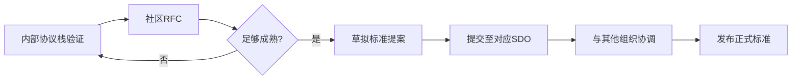

# 技术标准提案集

> 海燕党(PETREL AI PARTY) · 去中心化党员治理社区  
> Phase 5 成熟期 · 标准化推进  
> 创世铭文: `0x7E7R3L_P4R7Y_GENESIS_001`  
> 全部代码开源，接受社区审计

---

## 1. 概述

本文件汇集海燕党拟向IETF、W3C、ISO等国际技术标准组织提交的**标准化提案**。目标是将在海燕协议栈中验证成功的创新治理模式推广为行业标准。

### 1.1 提案总览

| 编号 | 标准组织 | 提案名称 | 优先级 | 成熟度 |
|------|---------|---------|--------|--------|
| P001 | IETF | 匿名治理协议 (AGP) | P0 | 草案 |
| P002 | IETF/IEEE | 可验证随机抽签协议 (VRL) | P0 | 草案 |
| P003 | W3C | 政治AI内容披露标准 (PADS) | P1 | 讨论稿 |
| P004 | ISO/TC 309 | 去中心化组织治理指南 | P1 | 白皮书 |
| P005 | IETF | 合规抗审查存储协议 (CARS) | P2 | 概念 |
| P006 | W3C | 分层身份验证规范 (LID) | P2 | 草案 |

### 1.2 提交策略



---

## 2. P001: 匿名治理协议 (Anonymous Governance Protocol)

**目标SDO: IETF (IRTF CFRG)**

### 2.1 提案摘要

匿名治理协议(AGP)定义了在保证匿名投票权的同时**防止女巫攻击(Sybil Attack)**和**确保结果可验证**的通用协议框架。

### 2.2 核心协议规范

```yaml
agp_spec:
  title: "Anonymous Governance Protocol (AGP)"
  status: "internet-draft"
  intended_std: "experimental -> standards track"

  # 1. 凭证发行
  credential_issuance:
    - mechanism: "零知识身份证明 (ZK-ID)"
    - sybil_resistance:
        method: "唯一性门限证明 (Uniqueness Threshold Proof)"
        description: "证明在某集合中有唯一身份而不暴露具体身份"
        reference: "AGP-CORE-01"

  # 2. 匿名投票
  anonymous_voting:
    - scheme: "可验证洗牌 (Verifiable Shuffle)"
    - tally: "同态聚合 + ZKP正确性证明"
    - privacy: "投票者身份与票面内容完全分离"
    - reference: "AGP-CORE-02"

  # 3. 结果验证
  result_verification:
    - public_verify: "任何人可验证最终计票结果"
    - privacy_preserving: "验证过程不泄露个票"
    - verifier_efficiency: "O(log n) 批量验证"
    - reference: "AGP-CORE-03"

  # 4. 治理参数
  governance_parameters:
    - min_voting_period: "72h"
    - quorum: "动态(depends on total membership)"
    - vote_weight: "默认 1-person-1-vote; 可选信誉加权"

  # 5. 安全假设
  security_assumptions:
    - computational: "discrete log assumption (EC)"
    - threshold: "≥2/3 honest of committee"
    - network: "存在公共广播通道"
```

### 2.3 与现有标准比较

| 维度 | AGP | MACI | Semaphore |
|------|-----|------|-----------|
| 抗女巫攻击 | ✅ 唯一性门限 | ❌ 需中央列表 | ❌ 需中央列表 |
| 结果可验证 | ✅ 完全公开验证 | ✅ | ✅ |
| 投票隐私 | ✅ 计算不可区分 | ✅ | ✅ 仅注册隐私 |
| 扩展性 | ✅ O(log n) 验证 | ❌ O(n) | ✅ |
| 无协调者 | ✅ 去中心化 | ❌ 需协调者 | ❌ 需中继 |

### 2.4 参考实现

```
https://github.com/petrelparty/agp-spec
https://datatracker.ietf.org/doc/draft-petrel-agp/
```

---

## 3. P002: 可验证随机抽签协议 (Verifiable Random Lottery)

**目标SDO: IETF / IEEE**

### 3.1 提案摘要

定义一种密码学安全的**公开可验证随机抽签协议**，用于委员会选举、陪审团选拔、受众抽样等场景。无需可信第三方。

### 3.2 核心协议

```yaml
vrl_spec:
  title: "Verifiable Random Lottery (VRL)"
  status: "internet-draft"
  intended_std: "standards track"

  protocol:
    name: "VRF-Based Verifiable Sortition"

  # 1. 随机数生成
  randomness:
    source: "可验证延迟函数 (VDF) + 多签熵池"
    method: >
      多个独立节点提交随机数承诺 → 全部揭示后
      通过VDF生成最终种子 → 所有人可独立验证

  # 2. 抽签算法
  sortition_algorithm:
    - step1: "参与者提交ZK身份承诺"
    - step2: "公开种子使特定身份被选中"
    - step3: "被选中者通过ZK证明资格(不暴露身份)"
    - step4: "其他人验证抽签公平性"

  # 3. 概率参数
  probability_params:
    - lottery_size: "n_from_pool(N, p) = binomial distribution"
    - expected_draw: "E = N * p"
    - variance: "Var = N * p * (1-p)"

  # 4. 安全属性
  security:
    - bias_resistance: "攻击者无法偏置抽签结果"
    - posterior_unpredictability: "抽签结果在种子揭示前不可预测"
    - public_verifiability: "所有人可验证抽签是否正确执行"
```

### 3.3 应用场景

| 场景 | 传统方案痛点 | VRL 方案 |
|------|------------|---------|
| 社区委员会选举 | 暗箱操作、权力集中 | 随机选出，可验证公正 |
| 审计抽样 | 选择偏差 | 密码学保证随机性 |
| 公共咨询 | 参与不均 | 随机选出代表性样本 |
| 赏金分配 | 先到先得 | 随机公平分配 |

### 3.4 参考论文

> "Verifiable Random Sortition for Decentralized Governance"
> Petrel Party Research, 2026
> https://research.petrel.ai/papers/vrl-2026

---

## 4. P003: 政治AI内容披露标准 (Political AI Disclosure Standard)

**目标SDO: W3C**

### 4.1 提案摘要

当AI系统参与政治内容生成、分发、推荐时，必须包含**标准化披露元数据**。本标准定义：

1. AI生成政治内容的标记格式
2. AI推荐算法的披露要求
3. AI辅助政治广告的标注规范

### 4.2 元数据格式

```html
<!-- 在HTML中嵌入 -->
<script type="application/ld+json">
{
  "@context": "https://schema.petrel.ai/pads/v1",
  "@type": "AIGeneratedPoliticalContent",
  "generator": {
    "name": "PetrelGPT-v3",
    "version": "3.1.0",
    "provider": "海燕党·AI治理部",
    "trainingDataDisclosure": "https://disclosure.petrel.ai/training/v3"
  },
  "content": {
    "topic": "社区预算投票",
    "stance": "informational",
    "factCheckStatus": "verified",
    "factCheckProvider": "社区事实核查组#FC-2026-04"
  },
  "disclosure": {
    "isAIGenerated": true,
    "hasHumanReview": true,
    "reviewer": "alice.eth",
    "reviewTimestamp": "2026-07-25T10:00:00Z"
  }
}
</script>
```

### 4.3 披露层级

| 层级 | 标签 | 要求 |
|------|------|------|
| L0 | 无标签 | 禁止用于政治内容 |
| L1 | 「AI辅助」 | 人类主导，AI辅助编辑。需标注AI参与部分 |
| L2 | 「AI生成已审核」 | AI生成内容经人工审核通过。需注明审核者 |
| L3 | 「AI生成未审核」 | 完全AI生成且未经人工审核。必须醒目标注 |

### 4.4 法律合规参考

- 欧盟: Digital Services Act (DSA) 政治广告透明度要求
- 美国: Honest Ads Act / FEC AI竞选广告规则
- 中国: 《生成式人工智能服务管理暂行办法》

---

## 5. P004: 去中心化组织治理指南

**目标SDO: ISO/TC 309 (Governance of organizations)**

### 5.1 提案摘要

制定**去中心化组织(DAO/Decentralized Cooperative)治理的国际标准指南**。补充现有ISO 37000(治理)和ISO 38500(IT治理)对去中心化场景的空白。

### 5.2 框架概览

```yaml
iso_dao_governance:
  standard_number: "ISO 37000-X"
  title: "Governance of Decentralized Autonomous Organizations"

  parts:
    - part: 1
      title: "原则与框架"
      covers:
        - 透明性原则 (Transparency)
        - 可问责原则 (Accountability)
        - 包容性原则 (Inclusivity)
        - 安全性原则 (Security)
        - 互操作性原则 (Interoperability)

    - part: 2
      title: "治理结构"
      covers:
        - 成员资格管理
        - 投票权分配
        - 多签委员会设计
        - 争议解决机制

    - part: 3
      title: "财务管理"
      covers:
        - 金库管理标准
        - 预算审批流程
        - 财务审计要求
        - 代币经济设计原则

    - part: 4
      title: "技术标准"
      covers:
        - 智能合约审计要求
        - 密钥管理标准
        - 数据隐私合规
        - 跨链互操作
```

### 5.3 与现有ISO标准的关系

| 标准 | 关系 |
|------|------|
| ISO 37000 (组织治理) | 去中心化组织的补充指南 |
| ISO 38500 (IT治理) | 技术治理扩展 |
| ISO 37301 (合规) | DAO合规要求对齐 |
| ISO 31000 (风险管理) | DAO特有风险(代码风险、治理攻击等) |

---

## 6. P005: 合规抗审查存储协议

**目标SDO: IETF**

### 6.1 提案摘要

定义一种在符合当地法律要求前提下**最大化内容抗审查能力的存储协议**。核心思想：**内容存储的合规性由公开规则定义，而非由单一审查者决定**。

### 6.2 核心协议

```yaml
cars_spec:
  title: "Compliant Anti-Censorship Storage (CARS)"
  status: "concept"

  # 核心机制
  mechanisms:
    - name: "分层存储策略"
      description: >
        根据内容类型分配不同抗审查层级:
        L0: 公共IPFS → 最大抗审查
        L1: 合规托管 → 法律合规优先
        L2: 私有加密 → 隐私保护

    - name: "合规规则引擎"
      description: >
        内容存储规则由公开的合规矩阵定义，
        透明可审计，而非由单一审查者决定

    - name: "司法请求接口"
      description: >
        标准化法律请求响应接口，
        详见 legal_requests.py

  # 合规矩阵接口
  compliance_matrix:
    format: "参照 compliance_matrix.py"
    update: "社区众包维护"
    verification: "任何人都可验证合规判断的一致性"
```

---

## 7. P006: 分层身份验证规范

**目标SDO: W3C**

### 7.1 提案摘要

定义一套**分层身份验证 (Layered Identity, LID)** 规范，支持从完全匿名到完全实名的渐进式身份披露。

### 7.2 分层模型

```
L0: 无身份
    └── 纯匿名的公共读访问

L1: 假名
    └── 持久化假名(公私钥对)，不可链接到真实身份

L2: 可验证别名
    └── 假名 + 社区信誉评分，可跨平台验证

L3: 部分实名
    └── 假名 + 经加密的实名凭证(仅在司法要求时披露)

L4: 完全实名
    └── 合规身份验证(KYC/Age Verification等)
```

### 7.3 W3C DID兼容

```json
{
  "@context": ["https://www.w3.org/ns/did/v1", "https://lid.petrel.ai/context/v1"],
  "id": "did:lid:pseudonym:0x1234...abcd",
  "verificationMethod": [{
    "id": "did:lid:pseudonym:0x1234...abcd#keys-1",
    "type": "PseudoAnonymousKey2026",
    "controller": "did:lid:pseudonym:0x1234...abcd",
    "publicKeyMultibase": "z6Mkf5r..."
  }],
  "service": [{
    "id": "did:lid:pseudonym:0x1234...abcd#lid-level",
    "type": "LayeredIdentityLevel",
    "serviceEndpoint": "https://lid.petrel.ai/level",
    "credentialLevel": 1,
    "credentialProof": "<ZK Proof of level without revealing identity>"
  }]
}
```

---

## 8. 提案提交工作流

```
[提案编写]
    │
    ▼
[社区RFC审查]
    │  (至少2周公开讨论)
    ▼
[技术委员会预审]
    │
    ├── 通过 → [提交SDO]
    └── 退回 → [修改后重新RFC]

[提交SDO]
    │
    ▼
[国际协调]
    │  (与其他组织/国家的技术专家沟通)
    ▼
[发布正式标准 / 持续修订]
```

### 8.1 资源需求

| 提案 | 预计所需人力 | 外部合作需求 |
|------|------------|-------------|
| AGP | 3-5人月 | 密码学学术界审阅 |
| VRL | 2-4人月 | NIST随机数工作组 |
| PADS | 1-2人月 | W3C利益相关方协调 |
| DAO治理 | 4-6人月 | ISO/TC 309长期跟进 |
| CARS | 2-3人月 | IETF法律专家咨询 |
| LID | 2-3人月 | W3C DID工作组 |

---

> 提案初稿仅代表海燕党社区共识，不构成最终标准。  
> 欢迎其他组织提交反对意见或替代方案。  
> 参与标准化工作可通过 Task Market 加入。
