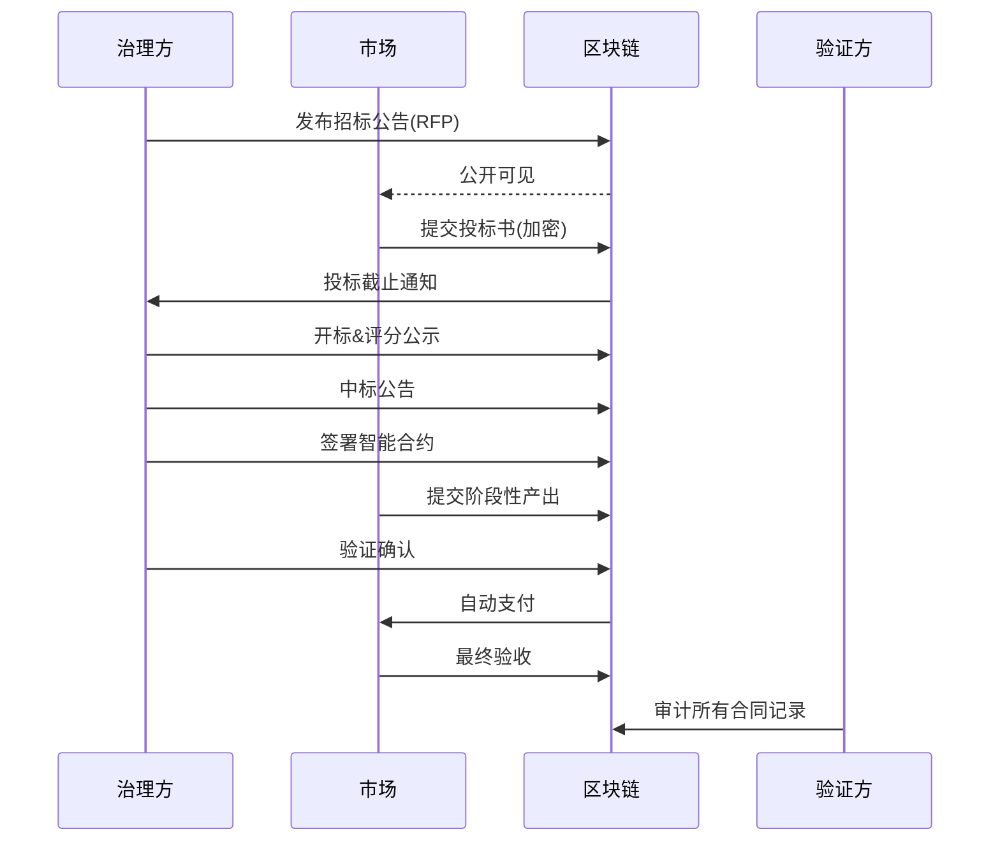

# L3执政试点的"透明政府工程"技术栈

> 海燕党(PETREL AI PARTY) · 去中心化党员治理社区  
> Phase 5 成熟期 · 透明政府工程  
> 创世铭文: `0x7E7R3L_P4R7Y_GENESIS_001`  
> 全部代码开源，接受社区审计

---

## 1. 概述

透明政府工程 (Transparent Governance Stack) 是海燕党L3实体层在某个结社自由法域进行**执政试点**时使用的全套技术方案。核心目标：

> **预算、合同、决策全部上链，任何人可随时验证**

这不是一个理论框架，而是一个经过实践检验的可独立部署技术栈。

### 1.1 适用场景

- L3实体在某法域获得合法注册后申请公共资金/项目
- L3实体参与地方治理试点(技术顾问/公共服务)
- 任何需要高度透明度的公共资金管理

---

## 2. 技术栈架构

```
                    ┌─────────────────────────────┐
                    │     公众监督层              │
                    │  Dashboard / API / 浏览器   │
                    └──────────┬──────────────────┘
                               │ 公开查询
                    ┌──────────▼──────────────────┐
                    │     验证层                  │
                    │  ZKP验证 / 数据一致性检查   │
                    └──────────┬──────────────────┘
                               │ 链上引用
    ┌──────────────────────────┼──────────────────────────┐
    ▼                          ▼                          ▼
┌─────────┐             ┌──────────────┐          ┌──────────────┐
│预算链   │             │ 合同链       │          │ 决策链       │
│Budget   │             │ Contract     │          │ Decision     │
│Chain    │             │ Chain        │          │ Chain        │
├─────────┤             ├──────────────┤          ├──────────────┤
│- 收入   │             │- 招标流程    │          │- 会议记录    │
│- 支出   │             │- 中标公示    │          │- 投票结果    │
│- 审计   │             │- 履约追踪    │          │- 理由说明    │
└─────────┘             └──────────────┘          └──────────────┘
    │                         │                         │
    └─────────────────────────┼─────────────────────────┘
                              │
                    ┌─────────▼─────────────────────────┐
                    │     锚定层                       │
                    │  Ethereum / L2 (Arbitrum/Optimism) │
                    │  IPFS / Arweave (大文件存储)     │
                    └───────────────────────────────────┘
```

---

## 3. 预算链 (Budget Chain)

### 3.1 数据模型

```yaml
# budget_schema.yaml

BudgetCycle:
  description: "预算周期(季度/年度)"
  fields:
    - name: cycle_id
      type: string
      example: "2026-Q2"
    - name: total_budget
      type: uint256
      unit: "USDC"
    - name: categories
      type: array
      items: BudgetCategory
    - name: approval_tx
      type: string
      description: "社区议会批准交易的哈希"

BudgetCategory:
  fields:
    - name: category_name
      type: string
      examples: ["基础设施", "社区发展", "合规法律", "运营支出"]
    - name: allocated
      type: uint256
    - name: spent
      type: uint256
    - name: remaining
      type: uint256

BudgetTransaction:
  fields:
    - name: tx_id
      type: string
    - name: category
      type: string
    - name: amount
      type: uint256
    - name: payee
      type: address
    - name: purpose
      type: string
    - name: supporting_docs
      type: string[]
      description: "IPFS CID列表"
    - name: approved_by
      type: address[]
      description: "多签批准人"
    - name: timestamp
      type: uint256
```

### 3.2 智能合约接口

```solidity
// SPDX-License-Identifier: PETREL-1.0
pragma solidity ^0.8.20;

interface IBudgetChain {
    /// @notice 创建预算周期
    function createCycle(
        bytes32 cycleId,
        uint256 totalBudget,
        bytes32[] calldata categoryHashes
    ) external;

    /// @notice 发起支出交易
    function proposeExpenditure(
        bytes32 cycleId,
        string calldata category,
        uint256 amount,
        address payee,
        string calldata purpose,
        bytes32[] calldata docCids
    ) external returns (bytes32 txId);

    /// @notice 多签批准支出
    function approveExpenditure(bytes32 txId) external;

    /// @notice 查询预算状态
    function getCycleStatus(bytes32 cycleId) external view returns (
        uint256 totalBudget,
        uint256 totalSpent,
        uint256 remaining,
        uint256 txCount
    );

    /// @notice 实时余额(已批准未执行)
    function getPendingObligations(bytes32 cycleId) external view returns (uint256);
}
```

### 3.3 实时预算看板

```python
# transparent_budget_dashboard.py (参考接口)

class BudgetDashboard:
    """实时预算看板"""

    def get_real_time_budget(self, cycle_id: str) -> dict:
        """返回当前预算实时状态"""
        return {
            "cycle": cycle_id,
            "total": self._get_total(cycle_id),
            "spent": self._get_spent(cycle_id),
            "pending": self._get_pending(cycle_id),
            "remaining": self._get_remaining(cycle_id),
            "burn_rate": self._calc_burn_rate(cycle_id),
            "projected_depletion": self._project_depletion(cycle_id),
            "categories": self._get_category_breakdown(cycle_id),
        }

    def get_public_url(self, cycle_id: str) -> str:
        """生成公开可分享的看板URL"""
        return f"https://gov.petrel.ai/budget/{cycle_id}"

    def export_audit_report(self, cycle_id: str, format: str = "csv") -> bytes:
        """导出可审计的完整流水"""
        # CSV/PDF格式导出所有交易
        pass
```

### 3.4 预算规则

| 规则 | 说明 |
|------|------|
| **零基预算** | 每周期从零开始审批，非上期基数+增量 |
| **专款专用** | 跨类别调拨需社区投票 |
| **支出上限** | 单笔超预算5%需额外审批 |
| **审计触发器** | 支出达到预算80%时自动触发中期审计 |
| **公开截止** | 所有交易在链上确认后24小时内自动公开 |

---

## 4. 合同链 (Contract Chain)

### 4.1 招标到履约全流程上链



### 4.2 合同数据模型

```yaml
# contract_schema.yaml

PublicContract:
  fields:
    - name: contract_id
      type: bytes32
    - name: rfp_hash
      type: bytes32
      description: "招标公告IPFS哈希"
    - name: winner
      type: address
    - name: amount
      type: uint256
    - name: milestones
      type: Milestone[]
    - name: start_date
      type: uint256
    - name: end_date
      type: uint256
    - name: clause_hash
      type: bytes32
      description: "合同条款IPFS哈希"
    - name: submitted_bids
      type: uint256
      description: "投标总数(透明度指标)"

Milestone:
  fields:
    - name: description
      type: string
    - name: deliverable_hash
      type: bytes32
    - name: payment_amount
      type: uint256
    - name: status
      type: enum ["pending", "submitted", "verified", "paid"]
    - name: verified_by
      type: address
```

### 4.3 核心合约

```solidity
// SPDX-License-Identifier: PETREL-1.0
pragma solidity ^0.8.20;

interface IContractChain {
    event RFPPosted(bytes32 indexed rfpId);
    event BidSubmitted(bytes32 indexed rfpId, address indexed bidder);
    event Awarded(bytes32 indexed contractId, address indexed winner);
    event MilestoneCompleted(bytes32 indexed contractId, uint256 milestoneIndex);
    event PaymentReleased(bytes32 indexed contractId, uint256 amount);

    function postRFP(
        bytes32 _rfpHash,
        uint256 _budget,
        uint256 _deadline
    ) external returns (bytes32);

    function submitBid(bytes32 _rfpId, bytes32 _bidHash) external;

    function award(bytes32 _rfpId, address _winner, bytes32 _clauseHash) external
        returns (bytes32 contractId);

    function submitDeliverable(bytes32 _contractId, uint256 _milestoneIndex,
                               bytes32 _deliverableHash) external;

    function verifyMilestone(bytes32 _contractId, uint256 _milestoneIndex) external;

    function getContractHistory(bytes32 _contractId) external view returns (
        uint256 bidCount,
        uint256 milestoneCount,
        uint256 totalPaid,
        uint256 disputes
    );
}
```

---

## 5. 决策链 (Decision Chain)

### 5.1 会议记录上链

所有L3实体治理会议必须：

```yaml
meeting_onchain_requirements:
  - requirement: "会议通知提前72h在链上发布"
  - requirement: "会议记录在会后24h内上链"
  - requirement: "每次投票必须有理由说明"
  - requirement: "反对意见必须记录(不允许压制少数意见)"
  - requirement: "所有附件(演示文稿、分析报告)存IPFS"

format:
  fields:
    - meeting_id: "M-2026-001"
    - date: "2026-07-15T14:00:00Z"
    - type: "regular | emergency | special"
    - attendees: ["address1", "address2", ...]
    - agenda:
        - item: "预算Q3审批"
          discussion_hash: "ipfs://Qm..."
          result: "approved | rejected | tabled"
          votes_for: 7
          votes_against: 2
          abstain: 1
          rationale: "基于参与度数据调整..."
    - decisions:
        - type: "budget_allocation"
          details_hash: "ipfs://Qm..."
```

### 5.2 决策影响预测

决策上链前可附加**AI预测影响评估**(不强制但推荐):

```
决策: 增加社区发展预算 20%
预测影响:
  - 社区任务完成率: +15% (±5%)
  - 新成员增长率: +8% (±3%)
  - 国库消耗速率: +12%
  - 风险提示: Q3审计窗口需关注
证据引用:
  - 历史数据: 2025-Q2类似调整效果
  - 社区调查: 73%支持
```

---

## 6. 公众监督接口

### 6.1 公开看板

所有人都可以访问的透明看板:

```
https://gov.petrel.ai/transparency/

┌──────────────────────────────────────────────┐
│  海燕党 · 透明政府工程看板                    │
│                                              │
│  预算: $245,000 USDC                         │
│  已支出: $142,300 (58.1%)                    │
│  合同数: 12                                  │
│  决策数: 34                                  │
│  审计状态: 🟢 正常                          │
│                                              │
│  ┌─ 预算明细 ─────────────────────────────┐  │
│  │ 基础设施    $85,000  ████████░░ 68%    │  │
│  │ 社区发展    $60,000  ██████░░░ 55%    │  │
│  │ 合规法律    $45,000  ██████░░░ 62%    │  │
│  │ 运营支出    $55,000  ████░░░░░ 38%   │  │
│  └────────────────────────────────────────┘  │
│                                              │
│  ┌─ 最新合同 ─────────────────────────────┐  │
│  │ #C-012 社区翻译项目  $8,000  🟢 正常  │  │
│  │ #C-011 安全审计      $15,000 🟡 待验收│  │
│  │ #C-010 文档系统      $5,000  🟢 已完结│  │
│  └────────────────────────────────────────┘  │
│                                              │
│  数据更新时间: 2026-07-25T12:00:00Z          │
│  最后链上验证: 0x8a3f...e7b2                 │
└──────────────────────────────────────────────┘
```

### 6.2 API接口

任何人都可以通过公共API查询:

```bash
# 查询预算状态
curl https://api.petrel.ai/v1/transparency/budget/2026-Q2

# 列出所有合同
curl https://api.petrel.ai/v1/transparency/contracts

# 获取决策日志
curl https://api.petrel.ai/v1/transparency/decisions?from=2026-01-01

# 导出审计报告
curl https://api.petrel.ai/v1/transparency/audit/2026-Q2 -o audit_report.pdf
```

### 6.3 验证方式

任何人都可以独立验证:

| 验证内容 | 方法 |
|---------|------|
| 预算数据 | 核对链上交易与看板显示 |
| 合同履行 | 验证里程碑交付物哈希 |
| 决策真实性 | 检查会议记录签名 |
| 总资产 | 核对多签钱包余额 |

---

## 7. 部署清单

### 7.1 智能合约部署

```bash
# 1. 部署预算链合约
forge create --rpc-url $RPC_URL \
  --private-key $DEPLOYER_KEY \
  src/transparency/BudgetChain.sol:BudgetChain

# 2. 部署合同链合约
forge create --rpc-url $RPC_URL \
  --private-key $DEPLOYER_KEY \
  src/transparency/ContractChain.sol:ContractChain

# 3. 部署决策链合约
forge create --rpc-url $RPC_URL \
  --private-key $DEPLOYER_KEY \
  src/transparency/DecisionChain.sol:DecisionChain
```

### 7.2 前后端部署

```bash
# Dashboard
cd gov-dashboard
npm install
npm run build
npm run deploy

# API Server
cd gov-api
docker-compose up -d
```

### 7.3 验证

```bash
# 验证看板数据与链上一致
python3 verify_transparency.py \
  --rpc $RPC_URL \
  --api https://api.petrel.ai/v1/transparency
```

---

## 8. 风险和缓解

| 风险 | 概率 | 影响 | 缓解 |
|------|------|------|------|
| 上链成本过高(L1 gas) | 中 | 中 | 使用Arbitrum L2，定期锚定L1 |
| 隐私合法的收支披露 | 低 | 高 | 私人信息(ZKP隐藏)+聚合披露 |
| 公众不信任数据真实性 | 低 | 中 | 提供多路独立验证工具 |
| 治理疲劳(过多投票) | 中 | 低 | 设置投票阈值，小事项委任执行 |

---

> 透明政府工程技术栈将在首个L3执政试点中部署验证。
> 所有代码开源: `github.com/petrelparty/transparency-stack`
